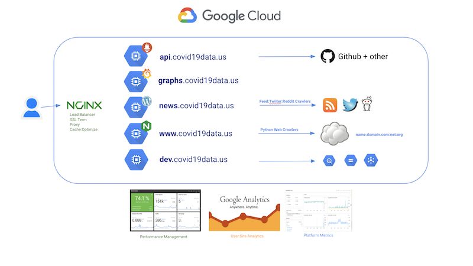

# covid19data.us

Everything related to Covid-19 data

- Simplification
- Aggregation
- Viewing
- Charting
- Managing

# Purpose

Software and data aggregation for

- Public 
- Examples
- Use-Cases 

## Goal of project

Make the time series data extremely easy for others to use, pull, chart.

## History

### [1.0.0] - 23-Jan-2020

- I started a world news :newspaper: aggregation site, after members of my remote teams in JPMC (APAC)  began discussing the topic of a new coronavirus. 
- Since I am proudly an x-Googler, I had a few data questions from some folks which was verified. 
- My x-Military contacts also confirmed movement on the topic. 
- That resulted in - organizing news so I could stay up to speed - traffic picked up and I needed some content checkers because the search is challenged and news agencies are less than accurate. 
- I currently have :three: people in PH checking/categorizing/posting content
- [covid19data.com](https://covid19data.com)
- In March, US :us: became a topic and I needed a more US :us: centric site. 
- I got some inspiration from a few medical specific sites and someone coined the phrase: Ninja Virus.
- [US Centric](https://ninjavirus.com) :us:
- These are Wordpress sites hosted on Google - with RSS crawlers, Twitter Crawler, URL Crawler, etc. 
- uggh@CMS@wordpress 
- I needed something click:fast [not my day job]

## Current Situation

- A few have contributed and probably this should merge into covidtracker project. 
- Over the weekend I opened up another GCP project and decided with the help of a couple of others to pull JHU :school: data into Prometheus and expose the endpoint and do a little Grafana work. 
- Add the datasource in Grafana (whosoever will)

## Contribute if you believe

"We should not hold data hostage"

"Keep it simple: Minimalist thinking"

"A language is a choice, whatever gets it done i.e. Polyglot" - we all have our favorites

## Useful Links

- [prometheus-TSDB](api.covid19data.us) with JHU covid data [nightly pulls]
- [grafana](graphs.covid19data.us) Grafana dashboards [share, embed, copy:paste, etc.]
- [dev.covid19data.us](dev.covid19data.us) Needs contributions
- [news.covid19data.us](news.covid19data.us) Transitioning [ninjavirus](https://ninjavirus.com) i.e. US centric WP site
- [www](graphs.covid19data.us) - defaults to [grafana](graphs.covid19data.us) for now - Needs contributions

**Footnotes:**

1. Credit to __**Johns Hopkins**__ for giving us the data
1. Credit to the __**covidtracker folks**__ for keeping an eye on the work there